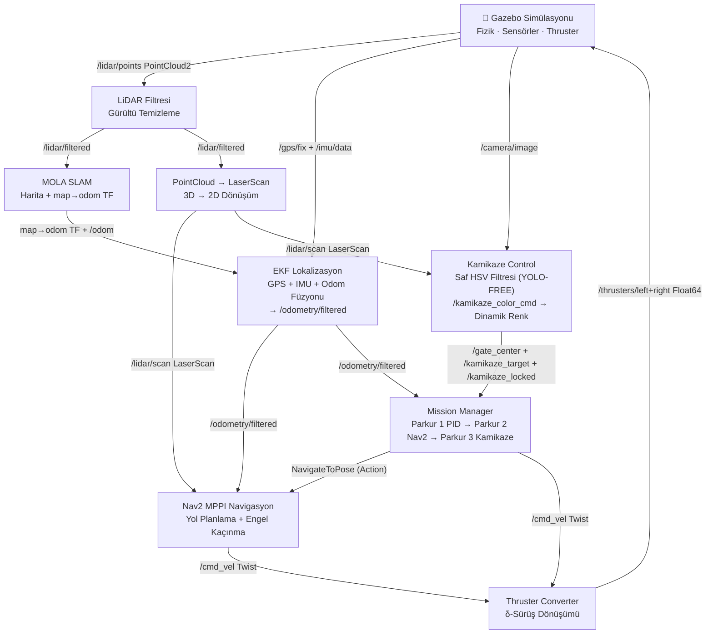
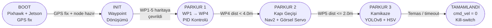
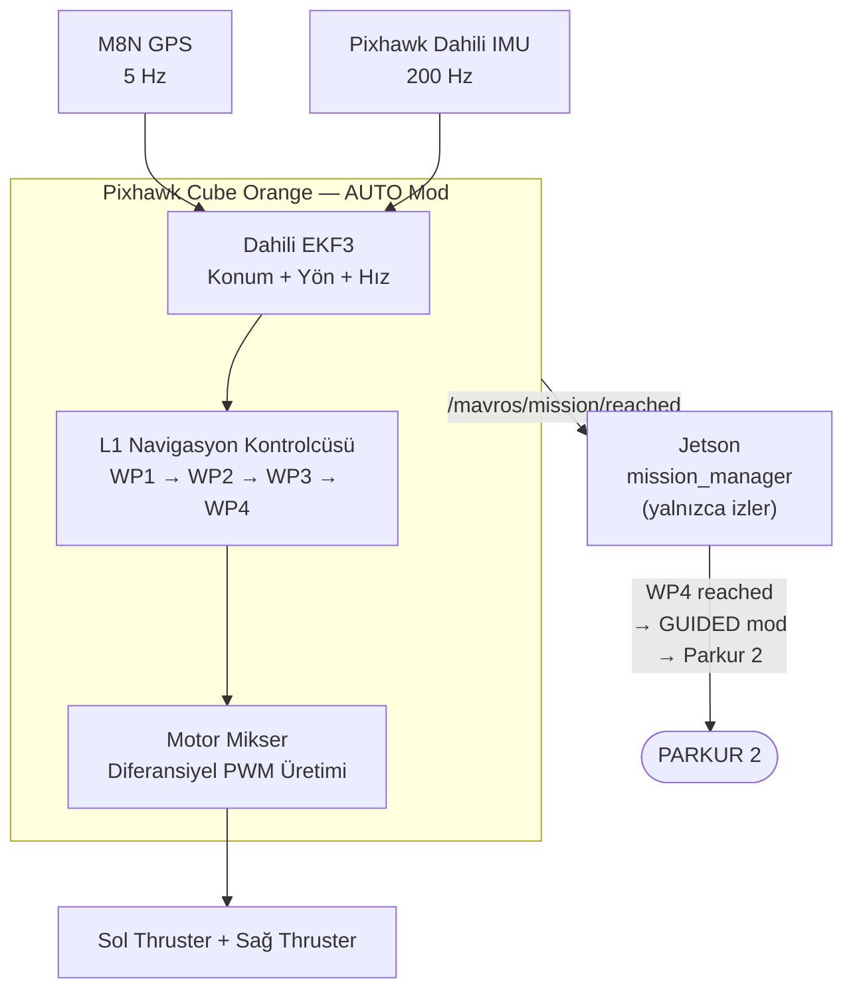
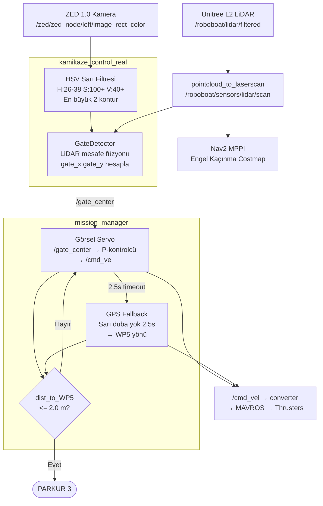
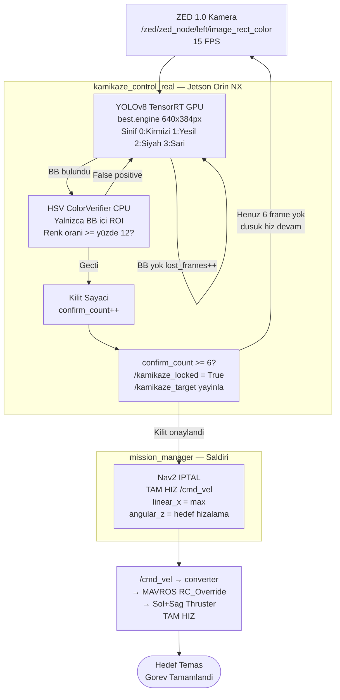

<div align="center">

<h1>STI_USV</h1>

**Otonom İnsansız Su Yüzeyi Aracı — TEKNOFEST Yarışma Navigasyon Sistemi**

[](https://releases.ubuntu.com/22.04/)
[](https://docs.ros.org/en/humble/)
[-F58113?logo=gazebo&logoColor=white)](https://gazebosim.org/docs/fortress/)
[](https://www.python.org/)
[](https://opencv.org/)
[](https://navigation.ros.org/)
[](./LICENSE.txt)

*Bitirme Projesi · Tam Otonom Navigasyon · TEKNOFEST USV Yarışması*

</div>

---

## 📋 İçindekiler

1. [Proje Genel Bakış](#-proje-genel-bakış)
2. [Temel Kaynak Kodunun Atıfı](#-temel-kaynak-kodunun-atıfı)
3. [Bu Projede Geliştirilen Özgün Mühendislik Katkıları](#-bu-projede-geliştirilen-özgün-mühendislik-katkıları)
4. [Sistem Mimarisi](#-sistem-mimarisi)
5. [Paket Yapısı](#-paket-yapısı)
6. [Kurulum ve Bağımlılıklar](#-kurulum-ve-bağımlılıklar)
7. [Kullanım](#-kullanım)
8. [**Uçtan Uca Sistem Akışı**](#-uçtan-uca-sistem-akışı)
9. [**Algoritma Tasarımları**](#-algoritma-tasarımları)
10. [Görev Senaryosu: TEKNOFEST Parkurları](#-görev-senaryosu-teknofest-parkurları)
11. [ROS Topic Referansı](#-ros-topic-referansı)
12. [Sorun Giderme](#-sorun-giderme)
13. [Katkıda Bulunanlar](#-katkıda-bulunanlar)

---

## 🎯 Proje Genel Bakış

**STI_USV**, TEKNOFEST İnsansız Su Araçları (İDA) yarışması görevlerini bağımsız olarak tamamlamak üzere tasarlanmış, tam otonom bir İnsansız Su Yüzeyi Aracı (USV) navigasyon sistemidir. Proje, bir **Bitirme Projesi** kapsamında geliştirilmiş olup gerçek dünya yarışma koşullarını simüle eden Gazebo Ignition (Fortress) ortamında doğrulanmıştır.

### Temel Teknik Hedefler

| Hedef | Yaklaşım |
|-------|----------|
| GPS Bazlı Açık Su Navigasyonu | Özel PID Yaw Kontrolcüsü |
| Duba Kapısı Geçişi (Slalom) | Nav2 MPPI + Güven Kilidi Algoritması |
| Kamikaze Saldırısı (Sim) | Saf HSV Renk Filtreleme (YOLO-FREE) |
| Kamikaze Saldırısı (Gerçek Dünya) | TensorRT YOLOv8 + HSV Doğrulama Füzyonu |
| Sağlam Nesne Algılama | OpenCV HSV Bant Filtreleme |
| Kesin Konum Belirleme | MOLA SLAM + EKF Sensör Füzyonu |

> **Akademik Not:** Bu depo, Bitirme Projesi danışmanlarının ve teknik jürilerin teknik derinliği doğrulayabilmesi amacıyla **mühendislik kararları ve tasarım gerekçeleriyle** birlikte dokümante edilmiştir.

---

## 🤝 Temel Kaynak Kodunun Atıfı

Bu projenin **3D simülasyon ortamı, su fiziği, bot modeli, sensör eklentileri ve temel ROS-Gazebo köprüleme altyapısı**, açık kaynak [STI-USV](https://github.com/STI-USV/STI-USV) projesinden türetilmiştir. Bu çalışmanın sağlam bir başlangıç noktası sunduğunu ve zaman kazandırdığını açıkça belirtmek ve ekibe teşekkür etmek isteriz.

**Temel kaynak katkıları:**
- Gazebo Ignition'da gerçekçi su fiziği (Gerstner dalgaları, hidrodinamik sürüklenme)
- USV tekne modeli (mesh, kütle, atalet özellikleri)
- Velodyne LiDAR, kamera ve GPS sensör eklentileri
- `ros_ign_bridge` aracılığıyla temel ROS-Gazebo topic köprüsü

Bu proje, yukarıdaki simülasyon katmanını **üretim düzeyinde bir otonom navigasyon yazılım yığınıyla** genişletmektedir.

---

## 🔬 Bu Projede Geliştirilen Özgün Mühendislik Katkıları

> Bu bölüm, temel kaynak repoya kıyasla projenin **özgün mühendislik değerini** ortaya koymaktadır.

### 1 · Algılama Mimarisi (`kamikaze_control.py` ve `kamikaze_control_real.py`)

> **Kritik Tasarım Kararı:** YOLOv11 simülasyonda tamamen kaldırıldı. Jetson Orin'in GPU/termal bütçesi gereksiz yere tüketilmemelidir. Gerçek dünya modülünde YOLO, yalnızca bounding box önermek için kullanılır; renk kararını HSV verir.

#### Simülasyon Modülü (`kamikaze_control.py`) — Saf HSV

```
Kamera Karesi
    ├── HSV Sarı Filtresi  → /gate_center    (Parkur 2 — kapı orta noktası)
    └── HSV Dinamik Hedef → /kamikaze_target  (Parkur 3 — kamikaze saldırısı)
                             0=KIRMIZI | 1=YEŞİL | 2=SİYAH
```

**Kapı Geometri Düzeltmesi:** İki sarı dubanın piksel merkezlerinden geometrik orta nokta hesaplanır. Tek bir LiDAR açısından mesafe okunur — eski "iki mesafenin ortalaması" yöntemi asimetrik mesafelerde sapıyordu.

```
    Eski: gate_x = (d_sol + d_sağ)/2 × orta_açı   ← HATALI (d_sol=7m, d_sağ=4m → 5.5m)
    Yeni: gate_px = (cx1+cx2)/2 → tek açı → LiDAR(o açı) → doğru 3D konum
```

#### Gerçek Dünya Modülü (`kamikaze_control_real.py`) — YOLOv8 TensorRT + HSV Füzyon

```
ZED Kamera (ROS2)
         │
   ┌─────▼──────────────────────────────┐
   │     BuoyPerception (GPU+CPU)        │
   │  1) TensorRT YOLOv8 (.engine)       │ ← GPU, 640×384px infer
   │  2) HSV ColorVerifier (ROI only)    │ ← CPU, yalnızca kutucuk içi
   │     ratio = renk_px / toplam_px     │
   │     ratio < 12% → REDDET            │
   └─────┬──────────────────────────────┘
         │ (cx_norm, area)
         ▼
   /kamikaze_target  +  /kamikaze_locked
```

**Jetson Orin Optimizasyonları:**
- Çıkarım girişi `640×384` — tam kare (1280×720) yerine
- HSV yalnızca YOLO ROI bölgesinde hesaplanır — tam kare maskeleme yok
- QoS depth=1 — eski kare birikimi yok
- Timer frekansı yapılandırılabilir (`INFER_HZ`, varsayılan 15 Hz)

---

### 2 · Görev Yönetimi ve Durum Makinesi (`mission_manager.py`)

Merkezi bir `MissionManager` düğümü, kameranın körleşmesine ya da GPS kaymasına karşı savunmacı geçiş koşulları uygulayarak üç parkuru sırasıyla yönetmektedir.

#### Parkur 1 — PID Yaw Kontrolcüsü

Nav2'nin doğrudan GPS koordinatlarına navigasyon yapmaması nedeniyle, WP1→WP4 arası için özel bir PID yaw kontrolcüsü yazılmıştır.

```
Hata Hesabı:     e = atan2(dy, dx) − robot_yaw       [radyan]
Kontrol Çıktısı: ω = Kp·e + Ki·∫e·dt + Kd·Δe/Δt     [rad/s]
İleri Hız:       Vx = Vmax · (1 − |e| / π)           [m/s]
```

| Parametre | Değer | Gerekçe |
|-----------|-------|---------|
| Kp | 1.5 | Hızlı azalma, ama aşım olmadan |
| Ki | 0.0 | Simülasyon ortamında rüzgar/drift yok |
| Kd | 1.2 | Anahtarlama salınımlarını söndürür |
| WP Toleransı | 1.5 m | Rüzgar taşınmasına karşı bant genişliği |

#### Parkur 2 — MPPI Slalom + Sniper Confidence Lock

**Problem:** Ham YOLOv11 tespit koordinatları, sahte olumlu tepkiler nedeniyle kare başına titreşir. Böyle ham verilerin Nav2 hedefleri olarak gönderilmesi, kontrolcü sunucusunu sürekli iptal/yeniden görev döngüsüne iter; bu da tutarsız kapı geçişlerine yol açar.

**Çözüm — GateFusionHandler Sniper Lock Algoritması:**

```python
# Sahte Kodla Temel Mantık
for her tespit:
    gate_harita_koord = lidar_kamera_fuzyon(tespit)
    if mesafe < MIN_KAPI_MENZILI:  kapat     # Çok yakın → reddet
    if mesafe > MAX_KAPI_MENZILI:  kapat     # Çok uzak  → reddet

    tampon.ekle(gate_harita_koord)           # Hareketli yavaşlatma tamponu

    if len(tampon) >= 3 AND std(tampon) < 1.0m:  # Düşük varyans → yüksek güven
        kilit_koordinat(ortalama(tampon))    # Nav2'ye YALNIZCA TEK BİR hedef gönder
        kilidi_asla_güncelleme()             # Titreşimi önle
```

Bu algoritma şu sorunları çözmektedir:
- **Hedef kayması:** Ortalama alma kural dışı tespitleri bastırır
- **Nav2 sarsıntısı:** Onaylanan her kapı için yalnızca bir hedef gönderilir
- **Nav2'nin LiDAR özellik kıtlığı:** Kapa tespiti yoksa koy, LiDAR costmap güvenli geçiş sağlar

MPPI kontrolcüsü iki farklı parametre kümesi arasında dinamik olarak değiştirilmektedir:

| Mod | Hız | Ufuk | Engel Ağırlığı | Ne Zaman |
|-----|-----|------|----------------|----------|
| **Sprint** | 2.5 m/s | 15 adım | 5 | Açık suda WP1→WP4 |
| **Slalom** | 0.8 m/s | 56 adım | 20 | Kapı geçişi WP5 |

#### Parkur 3 — Dinamik HSV Kamikaze Servo

Nav2 tamamen iptal edilir. Yetki, seçili renkteki dubayı kilitledikten sonra doğrudan `/cmd_vel`'e komut veren tam hız saldırı kontrolcüsüne aktarılır:

```
Hatay Hesabı: error_x = 0.5 − cx_norm     [-0.5 … +0.5]
ω  (rad/s)  = −Kp_yaw × error_x           [±0.6 ile sınırlı]
Vx (m/s)   = ATTACK_MAX_SPEED (1.0 m/s)  ← TAM HIZ (kilit sonrası)
```

**Dinamik Hedef Seçimi:**
```bash
# Runtime'da hedef renk değiştirme:
ros2 topic pub /kamikaze_color_cmd std_msgs/Int32 "{data: 0}"  # KIRMIZI
ros2 topic pub /kamikaze_color_cmd std_msgs/Int32 "{data: 1}"  # YEŞİL
ros2 topic pub /kamikaze_color_cmd std_msgs/Int32 "{data: 2}"  # SİYAH
```

**Kilitleme Mantığı:** Hedef renk `N=6` ardışık frame onaylandıktan sonra `kamikaze_locked=True` gönderilir. İletişim kesilirse `init_target_color` parametresine geri dönülür.

---

### 3 · Sağlamlık ve Graceful Degradation

| Arıza Durumu | Sistem Davranışı |
|--------------|-----------------|
| Kamera akışı kesildi | YOLO/HSV yayınları durur; navigasyon GPS+LiDAR costmap ile sürer |
| MOLA SLAM TF gecikti | Localization başlangıcı için 10 s ek bekleme zamanı uygulanır |
| Nav2 zaten çalışıyor | Başlatma betiği duplicate algılar, hata verir ve çıkar |
| Kırmızı duba kayboldu (timeout) | `lost > 3.0 s` → 0.6 rad/s yeniden arama spin hareketi |

---

## 🏗️ Sistem Mimarisi

### Bileşen Veri Akışı



### Görev Aşamasına Göre `/cmd_vel` Otoritesi

| Aşama | `/cmd_vel` Üreticisi | Nav2 Durumu | Pixhawk Modu |
|-------|----------------------|-------------|-------------|
| INIT | — | Bekliyor | HOLD |
| PARKUR 1 (WP1→WP4) | **Pixhawk dahili navigasyon** | Pasif | **AUTO** |
| PARKUR 2 (Slalom WP5) | Nav2 MPPI Kontrolcüsü → MAVROS | Aktif | GUIDED |
| PARKUR 3 (Kamikaze) | Mission Manager (Görsel Servo) → MAVROS | İptal Edildi | GUIDED |

---

## 📁 Paket Yapısı

```
sti_usv/src/usv_sim/
│
├── 📄 start_all.sh              # Tek komutla tam sistem başlatma
├── 📄 stop_all.sh               # Tüm süreçleri durdurma
│
├── workspace_gz/                # Gazebo Simülasyon Paketi [Upstream'den]
│   ├── launch/
│   │   └── simulation.launch.py # Ana simülasyon başlatıcı
│   ├── worlds/world.sdf         # Gazebo dünya dosyası (su + dalgalar)
│   ├── models/
│   │   ├── roboboat/            # USV gövde modeli (mesh, sensörler)
│   │   ├── buoys/               # Yarışma dubası modelleri
│   │   └── waves/               # Gerstner dalga yüzeyi
│   └── plugins/                 # Hidrodinamik ve skor eklentileri
│
├── workspace_ros/               # ROS 2 Çekirdek Paketi
│   ├── launch/
│   │   ├── localization.launch.py   # EKF + NavSat + Statik TF
│   │   ├── lidar_filter.launch.py   # Nokta bulutu filtreleme
│   │   └── mola_slam.launch.py      # MOLA SLAM başlatıcı
│   ├── config/
│   │   ├── ekf.yaml                 # EKF parametre dosyası
│   │   ├── navsat.yaml              # GPS dönüşüm parametreleri
│   │   └── static_transform.yaml   # Rijit TF dönüşümleri
│   └── scripts/
│       ├── converter.py             # cmd_vel → thruster dönüştürücü
│       ├── lidar_processor.py       # Nokta bulutu gürültü filtresi
│       ├── imu_covariance_repub.py  # IMU kovaryans ekleme
│       ├── gps_covariance_repub.py  # GPS kovaryans ekleme
│       └── wasd_teleop.py           # Manuel klavye kontrolü
│
└── workspace_nav/               # Navigasyon Paketi [Bu Projede Geliştirilen]
    ├── launch/
    │   └── nav2.launch.py           # Nav2 MPPI başlatıcı
    ├── config/
    │   └── nav2_params.yaml         # Nav2 ve MPPI parametre dosyası
    ├── json/
    │   └── waypoints.json           # TEKNOFEST waypoint koordinatları
    └── scripts/
        ├── mission_manager.py       # ★ 3 Aşamalı Görev Durum Makinesi
            ├── kamikaze_control.py      # ★ Simülasyon: Saf HSV Algılama (YOLO-FREE)
            └── kamikaze_control_real.py # ★ Gerçek Dünya: TensorRT YOLOv8 + HSV Füzyon
```

> `★` işareti bu projenin özgün katkılarını göstermektedir.

---

## ⚙️ Kurulum ve Bağımlılıklar

### Sistem Gereksinimleri

| Bileşen | Sürüm | Not |
|---------|-------|-----|
| İşletim Sistemi | Ubuntu 22.04 LTS | Zorunlu |
| ROS 2 | Humble Hawksbill | Zorunlu |
| Gazebo | Fortress (Ignition) | Zorunlu |
| Python | ≥ 3.10 | Zorunlu |
| GPU | NVIDIA (PRIME Offload) | Önerilir |

---

### Adım 1 — ROS 2 Humble Kurulumu

```bash
sudo apt update && sudo apt install -y curl gnupg lsb-release
sudo curl -sSL https://raw.githubusercontent.com/ros/rosdistro/master/ros.key \
    -o /usr/share/keyrings/ros-archive-keyring.gpg
echo "deb [arch=$(dpkg --print-architecture) signed-by=/usr/share/keyrings/ros-archive-keyring.gpg] \
    http://packages.ros.org/ros2/ubuntu $(lsb_release -cs) main" \
    | sudo tee /etc/apt/sources.list.d/ros2.list
sudo apt update
sudo apt install -y ros-humble-desktop python3-colcon-common-extensions
```

---

### Adım 2 — ROS 2 Bağımlılıklarının Kurulumu

```bash
sudo apt install -y \
    ros-humble-ros-gz \
    ros-humble-xacro \
    ros-humble-robot-localization \
    ros-humble-nav2-bringup \
    ros-humble-navigation2 \
    ros-humble-slam-toolbox \
    ros-humble-pointcloud-to-laserscan \
    python3-pip
```

---

### Adım 3 — MOLA SLAM Kurulumu

```bash
# MOLA PPA deposunu ekle
sudo apt-add-repository ppa:joseluisblancoc/mola-slam
sudo apt update
sudo apt install -y ros-humble-mola-lidar-odometry
```

---

### Adım 4 — Python Bağımlılıklarının Kurulumu

```bash
pip install ultralytics opencv-python-headless numpy
```

---

### Adım 5 — Depoyu Klonlama ve Derleme

```bash
mkdir -p ~/sti_usv/src
cd ~/sti_usv/src
git clone https://github.com/<kullanici_adi>/sti_usv.git usv_sim

cd ~/sti_usv
source /opt/ros/humble/setup.bash
colcon build --symlink-install
```

> **Not:** `--symlink-install` bayrağı, betik değişikliklerinin yeniden derleme gerektirmeden etkili olmasını sağlar.

---

### Adım 6 — Ortamı Kaynak Gösterme

```bash
# Geçici (yalnızca bu terminal)
source /opt/ros/humble/setup.bash
source ~/sti_usv/install/setup.bash

# Kalıcı (her yeni terminalde otomatik)
echo "source /opt/ros/humble/setup.bash"    >> ~/.bashrc
echo "source ~/sti_usv/install/setup.bash"  >> ~/.bashrc
source ~/.bashrc
```

---

## 🚀 Kullanım

### Tek Komutla Başlatma (Önerilen)

```bash
cd ~/sti_usv/src/usv_sim
./start_all.sh auto
```

Bu komut şu sırayla 9 bileşeni başlatır:

| # | Bileşen | Bekleme |
|---|---------|---------|
| 1 | Gazebo Simülasyonu (GPU offload ile) | ~60 s (hazır beklenir) |
| 2 | LiDAR Filtresi | — |
| 3 | PointCloud → LaserScan Dönüştürücü | +2 s |
| 4 | MOLA SLAM | +3 s |
| 5 | EKF Lokalizasyon | +10 s |
| 6 | Nav2 MPPI Navigasyonu | +3 s |
| 7 | Mission Manager | +8 s |
| 8 | Kamikaze Control (YOLO) | +1 s |
| 9 | Thruster Converter | +2 s |

**Sistemi Durdurmak:**
```bash
./stop_all.sh
# veya
Ctrl + C
```

---

### Mod Seçenekleri

| Komut | Amaç | Başlatılan Bileşenler |
|-------|------|----------------------|
| `./start_all.sh` | Temel simülasyon | Gazebo + LiDAR Filtresi + KISS-ICP |
| `./start_all.sh mola` | Tam SLAM testi | + MOLA SLAM + EKF + Nav2 |
| `./start_all.sh auto` | **Tam otonom görev** | + Mission Manager + Kamikaze Control |
| `./start_all.sh parkour` | Reaktif navigasyon | Gazebo + LiDAR + Parkur Navigasyonu |

---

### Görev Parametrelerini Özelleştirme

```bash
# Ortam değişkenleriyle parametreleri geçersiz kılın
KAMIKAZE_TRIGGER_DIST=8.0 \
BASE_SPEED=2.0 \
KP_YAW=1.5 \
./start_all.sh auto
```

---

### Manuel Klavye Kontrolü

```bash
ros2 run workspace_ros wasd_teleop
```

| Tuş | Hareket |
|-----|---------|
| `W` | İleri |
| `S` | Geri |
| `A` | Sola Dönüş |
| `D` | Sağa Dönüş |
| `Q` | Dur |
| `ESC` | Çıkış |

---

## 🔄 Uçtan Uca Sistem Akışı

> Bu bölüm, İDA'ya güç verilmesinden görevin sonuçlandırılmasına kadar gerçek donanım üzerindeki fonksiyonel süreci anlatmaktadır.

### Gerçek Donanım Platformu

| Bileşen | Donanım | Görev |
|---------|---------|-------|
| Hesaplama | Jetson Orin NX 8 GB | Algılama, görev yönetimi, ROS 2 |
| Otopilot | Pixhawk Cube Orange (ArduRover) | Motor karması, IMU, GPS köprüsü |
| Kamera | ZED 1.0 Stereo | Duba tespiti, kapı algılama |
| LiDAR | Unitree L2 (3D) | Engel tespiti, kapı mesafesi |
| GPS | M8N + Compass | Waypoint navigasyonu |
| Haberleşme | 868 MHz Telemetri | Komut/izleme, kill-switch |
| Güç | 2 × 4S 14.8V 12Ah LiPo | PDB → BEC → Tüm sistemler |

### Adım 1 — Güç Verme ve Donanım Başlatma

```
1. 2× 4S LiPo bağlanır → Ana güç şalteri açılır
2. Kill-switch pasif konuma alınır (motorlar kapalı)
3. PDB üzerinden güç dağıtımı:
   • Thruster ESC'ler → 14.8V direkt
   • Jetson Orin NX  → 12V BEC
   • Pixhawk          → 5.3V Power Module
   • Unitree L2       → 12V BEC
4. Pixhawk boot (~8s) → ArduRover firmware → M8N GPS fix bekler
5. Jetson boot (~30s) → Ubuntu 22.04
6. ZED 1.0 → USB 3.0 üzerinden Jetson'a otomatik bağlanır
```

### Adım 2 — `./start_all.sh auto` ile ROS 2 Node'larının Başlatılması

| Sıra | Node / Servis | Çıktı Topic | Süre |
|------|--------------|-------------|------|
| 1 | `unitree_lidar_ros2` | `/roboboat/lidar/filtered` | ~5s |
| 2 | `zed_wrapper` | `/zed/zed_node/left/image_rect_color` | ~8s |
| 3 | `mavros_node` | `/mavros/global_position/local`, `/mavros/imu/data` | ~5s |
| 4 | `pointcloud_to_laserscan` | `/roboboat/sensors/lidar/scan` | ~2s |
| 5 | `mola_slam` | `map → odom TF` | +10s |
| 6 | `robot_localization` EKF | `/odometry/filtered` | +3s |
| 7 | `nav2_bringup` | `NavigateToPose action` | +10s |
| 8 | `mission_manager` | `/cmd_vel`, `/mission_state` | +8s |
| 9 | `kamikaze_control_real` | `/gate_center`, `/kamikaze_target`, `/kamikaze_locked` | +1s |
| 10 | `converter` | `/mavros/rc/override` | +2s |

### Adım 3 — INIT: GPS Waypoint Dönüşümü

Sistem hazır olduktan sonra `mission_manager` INIT aşamasına girer:

```
waypoints.json okunur → WP1, WP2, WP3, WP4, WP5
    ↓
/fromLL servisi çağrılır (robot_localization)
    → GPS (lat/lon) koordinatları → Harita çerçevesi (x, y) metre
    ↓
Tüm dönüşümler tamamlanınca → PARKUR 1 başlar
```

> M8N GPS, 3D fix ve HDOP < 2.0 gelmeden sistem bekler.

### Adım 4 — Parkur Geçişleri ve Görev Sonlandırma



| Geçiş | Tetikleyici Koşul |
|-------|------------------|
| Boot → INIT | Tüm ROS 2 node'ları başladı |
| INIT → Parkur 1 | `waypoints.json` dönüşümü tamamlandı |
| Parkur 1 → Parkur 2 | WP4'e mesafe < 4.0 m |
| Parkur 2 → Parkur 3 | WP5'e mesafe ≤ 2.0 m (tek geçiş koşulu) |
| Parkur 3 → Tamamlandı | Kamikaze temas veya timeout |

---

## 🧠 Algoritma Tasarımları

> Her parkur için hangi sensör verilerinin nasıl kullanıldığı ve temel algoritma akışı aşağıda tanımlanmıştır.

### Parkur 1 — Pixhawk AUTO Modu ile GPS Waypoint Navigasyonu

**Kullanılan Sensörler:**
- **M8N GPS** (5 Hz) → Pixhawk dahili navigasyon için konum kaynağı
- **Pixhawk IMU** (200 Hz) → Dahili EKF3 yaw ve hız tahmini
- **Pixhawk EKF3** → Konum, yön ve hız füzyonu

**Algoritma Akışı:**

Waypoint koordinatları Jetson üzerinden MAVROS `/mavros/mission/push` servisi ile Pixhawk'a yüklenir. Pixhawk **AUTO moda** alınır. Pixhawk'ın dahili **L1 navigasyon kontrolcüsü**, GPS ve IMU verilerini EKF3 ile birleştirerek WP1→WP4 rotasını takip eder. Thruster PWM karması Pixhawk tarafından doğrudan üretilir. Jetson bu aşamada `/mavros/mission/reached` topic'ini dinler; WP4 mesajı alındığında Pixhawk GUIDED moda geçirilir ve Parkur 2 başlar.



**WP Toleransı:** ArduRover parametresi `WPNAV_RADIUS` ile ayarlanır (varsayılan ~2 m).

**P1 → P2 Geçiş:** `/mavros/mission/reached` topic'inde WP4 indeksi görüldüğünde `mission_manager` P2'yi tetikler.

---

### Parkur 2 — HPV Kapı Tespiti + Nav2 MPPI Engel Kaçınma

**Kullanılan Sensörler:**
- **ZED 1.0 Kamera** → HSV sarı duba tespiti
- **Unitree L2 LiDAR → `/roboboat/sensors/lidar/scan`** → Kapı mesafesi ve engel costmap
- **M8N GPS + EKF** → WP5 mesafesi takibi ve fallback yönlendirme
- **Nav2 MPPI** → Arka planda engel kaçınma costmap yönetimi

**Algoritma Akışı:**

`kamikaze_control_real` node'u kameradan sarı dubaları HSV ile tespit edip LiDAR mesafesiyle birleştirerek `/gate_center` yayınlar. `mission_manager` bu bilgiyi görsel servo (P-kontrolcü) olarak kullanır. Sarı duba kaybolursa GPS yönünde kör ilerleme (fallback) devreye girer.



**GateDetector Mantığı:**
- 2 sarı duba: Piksel midpoint → LiDAR açısından mesafe → `gate_x, gate_y (base_link)`
- 1 sarı duba: ±1.125 m sanal ofset ile kapı tahmini
- 0 sarı duba: `/yellow_visible = False`, GPS fallback başlar

---

### Parkur 3 — TensorRT YOLOv8 + HSV Renk Doğrulama ile Kamikaze Saldırısı

**Kullanılan Sensörler:**
- **ZED 1.0 Kamera** (15 FPS) → YOLOv8 + HSV pipeline girişi
- **Jetson Orin NX GPU** (Ampere 32 Tensor Core) → TensorRT `best.engine` çıkarımı
- **Jetson CPU** → HSV ColorVerifier (BB içi ROI)

**Algoritma Akışı:**

Özel duba veri setiyle eğitilmiş YOLOv8 modeli TensorRT `.engine` formatına dönüştürülmüş ve Jetson GPU'sunda çalıştırılmaktadır. Her bounding box için CPU'da HSV renk doğrulaması yapılır. 6 ardışık frame onayı sonrası tam hız saldırı başlar.



**Hedef Renk Seçimi:**
- `init_target_color` ROS 2 parametresi ile başlangıçta ayarlanır (`0`=Kırmızı, `1`=Yeşil, `2`=Siyah)
- 868 MHz telemetri üzerinden `/kamikaze_color_cmd` (Int32) ile runtime değiştirilebilir
- İletişim kesilirse parametre değeri geçerliliğini korur (failsafe)

---

## 🏁 Görev Senaryosu: TEKNOFEST Parkurları

### Parkur 1 — Pixhawk AUTO Modu ile GPS Waypoint Navigasyonu

**Mimari:** Parkur 1'de navigasyon hesaplaması **tamamen Pixhawk Cube Orange** üzerinde gerçekleşir. Waypoint koordinatları Jetson üzerinden MAVROS aracılığıyla Pixhawk'a mission olarak yüklenir. Pixhawk **AUTO moduna** alınır ve dahili **EKF3 + L1 navigasyon algoritması** ile WP1'den WP4'e kadar olan rotayı takip eder. Diferansiyel thruster karması (sol/sağ PWM) doğrudan Pixhawk tarafından üretilir. Jetson bu aşamada yalnızca `/mavros/mission/reached` topic'ini izler; WP4'e ulaşıldığında durum makinesi tetiklenir ve Pixhawk GUIDED moda alınarak Parkur 2 başlar.

```
    [Başlangıç] ──AUTO──► [WP1] ──► [WP2] ──► [WP3] ──► [WP4]
                   Pixhawk iç navigasyon (EKF3 + L1)
                   Jetson yalnızca /mavros/mission/reached izler
```

### Parkur 2 — MPPI Slalom Kapı Geçişi

```
[WP4] ──Nav2/MPPI──► [Kapı 1] ──► [Kapı 2] ──► [Kapı N] ──► [WP5]
           ↑                  ↑
     Sniper Lock        GateFusion
  (Güven Kilidi)    (LiDAR+Kamera)
```

- **Kontrol:** Nav2 MPPI Kontrolcüsü — /cmd_vel üretir
- **Kapı Tespiti:** `kamikaze_control` → `/gate_center` → `mission_manager` → Nav2 hedefi
- **Geçiş:** WP5'e `5.0 m` yaklaşıldığında veya Nav2 hedefe ulaştığında

### Parkur 3 — Kamikaze Görsel Servo

```
[WP5] ──Kamera──► [Kırmızı Duba Algılandı] ──3s Kilit──► [Kamikaze Aktif]
                          ↓
               Nav2 İPTAL EDİLDİ
               Doğrudan /cmd_vel (Görsel Servo)
                          ↓
                   [Hedef Vuruldu] ──► COMPLETE
```

---

## 📡 ROS Topic Referansı

### Sensör Topic'leri (Gazebo → ROS)

| Topic | Tip | Açıklama |
|-------|-----|----------|
| `/roboboat/lidar/points` | `PointCloud2` | Ham 3D LiDAR bulutu |
| `/roboboat/lidar/filtered` | `PointCloud2` | Filtrelenmiş nokta bulutu |
| `/roboboat/sensors/lidar/scan` | `LaserScan` | 2D tarama (PC→LS dönüşümü) |
| `/roboboat/sensors/camera/image` | `Image` | Ham kamera akışı |
| `/gps/fix` | `NavSatFix` | Ham GPS koordinatları |
| `/imu/data` | `Imu` | Ham IMU ölçümleri |

### İşlenmiş Topic'ler

| Topic | Tip | Açıklama |
|-------|-----|----------|
| `/odometry/filtered` | `Odometry` | EKF füzyon çıktısı |
| `/odom` | `Odometry` | MOLA SLAM odometrisi |
| `/mission_state` | `String` | Anlık görev aşaması |

### Kamikaze/Vision Topic'leri

| Topic | Tip | Açıklama |
|-------|-----|----------|
| `/kamikaze_target` | `Point` | Hedef merkezi (error_x, cy_norm, alan) |
| `/kamikaze_locked` | `Bool` | Kilitleme onayı (N frame sonra True) |
| `/kamikaze_color_cmd` | `Int32` | Runtime hedef renk: 0=KIRMIZI, 1=YEŞİL, 2=SİYAH |
| `/gate_center` | `PoseStamped` | Kapı merkezi (base_link frame) |
| `/yellow_visible` | `Bool` | Sarı duba görünürlük durumu |

### Kontrol Topic'leri

| Topic | Tip | Açıklama |
|-------|-----|----------|
| `/cmd_vel` | `Twist` | Hız komutu |
| `/roboboat/thrusters/left/thrust` | `Float64` | Sol thruster kuvveti |
| `/roboboat/thrusters/right/thrust` | `Float64` | Sağ thruster kuvveti |

---

## 🔧 Sorun Giderme

### Gazebo Açılmıyor / Yanıt Vermiyor

```bash
# Kilitli Gazebo süreçlerini temizle
pkill -f "ign gazebo"; pkill -f "ruby.*gz"
sleep 3 && ./start_all.sh auto
```

### TF Ekstrapolasyon Hatası

```
[WARN] Lookup would require extrapolation...
```

`use_sim_time:=true` parametresinin tüm düğümlere doğru şekilde iletilip iletilmediğini doğrulayın:

```bash
ros2 param get /mission_manager use_sim_time
ros2 param get /kamikaze_control use_sim_time
```

### Nav2 Zaten Çalışıyor Hatası

```bash
pkill -f "lifecycle_manager"
pkill -f "nav2_container"
sleep 2 && ./start_all.sh auto
```

### MOLA SLAM Başlamıyor

MOLA'nın `/roboboat/lidar/filtered` topic'ini yayınlanmadan başlatılmasını önlemek için betikte 10 saniyelik bekleme süresi bulunmaktadır. Sorun devam ederse:

```bash
ros2 topic hz /roboboat/lidar/filtered   # Verinin gelip gelmediğini kontrol edin
```

### Sistem Durumunu İzleme

```bash
# Görev aşamasını izle
ros2 topic echo /mission_state

# Tüm aktif topic'leri listele
ros2 topic list

# Topic frekanslarını kontrol et
ros2 topic hz /odometry/filtered
ros2 topic hz /roboboat/sensors/lidar/scan
```

---

## 👥 Katkıda Bulunanlar

### Bu Projeyi Geliştiren (STI_USV Özgün Yazılım Yığını)

Bu deponun özgün navigasyon yazılım yığını (Göreve Özel Algılama, Sniper Lock, PID Kontrolcüsü, Mission Manager) **Bitirme Projesi** kapsamında geliştirilmiştir.

---

### Gazebo Simülasyon Ortamına Katkıda Bulunanlar ([STI-USV](https://github.com/STI-USV/STI-USV))

Bu projenin 3D simülasyon altyapısı aşağıdaki geliştiricilerin çalışmalarına dayanmaktadır:

| İsim | GitHub |
|------|--------|
| Görkem Direybatoğulları | [@GorkemDireybatogullari](https://github.com/GorkemDireybatogullari) |
| Mustafa Berat Yavaş | [@MustafaBeratYavas](https://github.com/MustafaBeratYavas) |
| Muhammet Al | [@MuhammetAll](https://github.com/MuhammetAll) |
| Muhammed Kerem Demirbent | [@MuhammedKeremDemirbent](https://github.com/MuhammedKeremDemirbent) |
| Harun Kurt | [@harunkurtdev](https://github.com/harunkurtdev) |

---

## 📚 Referanslar

- [ROS 2 Humble Dokümantasyonu](https://docs.ros.org/en/humble/)
- [Nav2 MPPI Kontrolcüsü](https://navigation.ros.org/configuration/packages/controller_plugins/mppi.html)
- [MOLA SLAM Kütüphanesi](https://github.com/MOLAorg/mola)
- [Ultralytics YOLOv11](https://docs.ultralytics.com/)
- [robot_localization EKF](https://docs.ros.org/en/humble/p/robot_localization/)
- [Toward Maritime Robotic Simulation in Gazebo](https://wiki.nps.edu/display/BB/Publications?preview=/1173263776/1173263778/PID6131719.pdf)

---

## 📄 Lisans

Bu proje [Apache License 2.0](./LICENSE.txt) kapsamında lisanslanmıştır.

---

<div align="center">

**STI_USV** · Bitirme Projesi · TEKNOFEST İDA Yarışması

</div>
