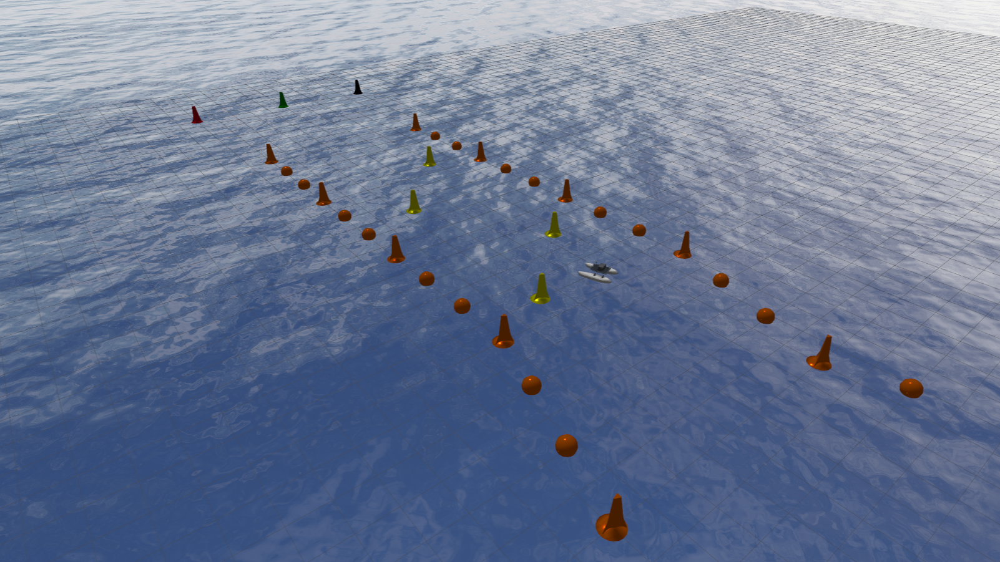
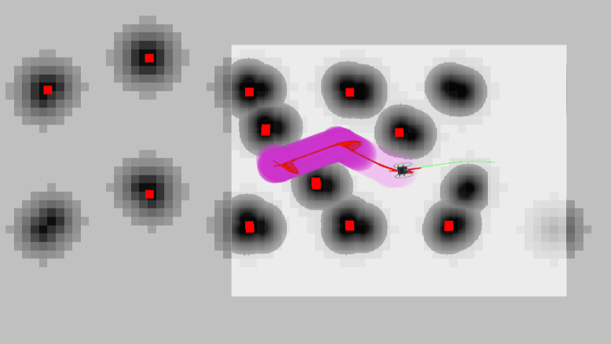
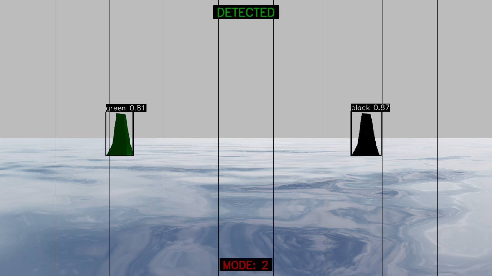

[](https://releases.ubuntu.com/24.04/)
[](https://docs.ros.org/en/jazzy/)
[](https://gazebosim.org/docs/harmonic/)
[](./LICENSE.txt)

This repository provides a Gazebo Harmonic-based simulation and ROS 2 Jazzy toolchain for rapid prototyping and validation of localization, perception, and Navigation2-based autonomy

---

## Project Structure

```
USV/
├── README.md
├── LICENSE.txt
├── CONTRIBUTING.md
├── requirements.txt                    # Python dependencies
├── images/                             # Documentation images
│
├── workspace_gz/                       # Gazebo Simulation Package
│   ├── CMakeLists.txt
│   ├── package.xml
│   ├── launch/
│   │   └── simulation.launch.py        # Main simulation launcher
│   ├── description/
│   │   └── roboboat/roboboat.xacro     # Robot URDF/Xacro
│   ├── worlds/
│   │   └── world.sdf                   # Gazebo world file
│   ├── models/
│   │   ├── roboboat/                   # USV model (meshes, textures, sensors)
│   │   ├── buoys/                      # Marker buoys (red, green, yellow, etc.)
│   │   └── waves/                      # Water surface with Gerstner waves
│   └── plugins/                        # Gazebo plugins (hydrodynamics, scoring, etc.)
│
├── workspace_ros/                      # ROS 2 Core Package
│   ├── package.xml
│   ├── setup.py
│   ├── launch/
│   │   ├── localization.launch.py      # EKF + NavSat transform
│   │   └── lidar_filter.launch.py      # LiDAR point cloud filtering
│   ├── config/
│   │   ├── ekf.yaml                    # Extended Kalman Filter params
│   │   ├── navsat.yaml                 # GPS transform params
│   │   ├── static_transform.yaml       # TF frames
│   │   └── lidar_filter.yaml           # LiDAR filter params
│   ├── scripts/
│   │   ├── converter.py                # Thrust command converter
│   │   ├── imu_covariance_repub.py     # IMU covariance republisher
│   │   ├── gps_covariance_repub.py     # GPS covariance republisher
│   │   ├── static_transform_publisher.py
│   │   ├── lidar_processor.py          # 3D LiDAR filtering (RANSAC water removal)
│   │   ├── target_buoy.py              # YOLO-based buoy detection
│   │   ├── manual_control.py           # Keyboard teleop
│   │   └── kamikaze.py                 # Direct intercept mode
│   └── YOLOv11/
│       └── YOLOv11.pt                  # YOLO model weights
│
└── workspace_nav/                      # Navigation Package
    ├── package.xml
    ├── setup.py
    ├── launch/
    │   └── nav2.launch.py              # Navigation2 bringup
    ├── config/
    │   ├── nav2_params.yaml            # Nav2 parameters
    │   └── map.yaml                    # Map configuration
    ├── map/
    │   └── map.pgm                     # Occupancy grid map
    ├── json/
    │   ├── waypoints.json              # Mission waypoints (from GCS)
    │   └── target_buoy.json            # Target buoy configuration
    └── scripts/
        ├── waypoint_transform.py       # GPS to local coordinate transform
        └── waypoint_with_state.py      # Waypoint following state machine
```

---

## Simulation Environment



*Figure: Gazebo Harmonic simulation environment illustrating the USV model, buoy configurations, and hydrodynamic interactions used for testing perception, localization, and autonomous navigation pipelines.*

## Robot Localization and Navigation2



*Figure: RViz2 visualization of the Localization and Navigation2 stack — EKF-based IMU/GPS fusion for state estimation, with Navigation2 handling path planning and obstacle avoidance.*

## Targeted Engagement



*Figure: Visualization of real-time target detection and interception — YOLO-based buoy segmentation with corresponding motion commands for direct intercept maneuvers and live detection/navigation feedback.*

<details>
<summary>Algorithm Overview</summary>

- **Purpose:** Processes camera frames with a YOLO segmentation model to detect the target buoy and generate intercept commands.
- **Target configuration:** The target tag is read from `workspace_nav/json/target_buoy.json`.
- **Inference & selection:** The node performs model inference per frame, selects the highest-confidence detection that matches the configured target, and determines its horizontal column position.
- **Control output:** Maps the detection column to simple linear/angular `geometry_msgs/Twist` commands and publishes them on `/cmd_vel_nav`. If no detection is available, a fallback search (recovery) behavior is used.
- **Visualization:** Detections, labels and status are rendered in an OpenCV window for debugging and operator feedback.
- **Model lookup:** `workspace_ros/YOLOv11/YOLOv11.pt`.
- **Key topics:** image input `/roboboat/sensors/camera/image`; command output `/cmd_vel_nav`.

</details>

---

## Installation

### Prerequisites

| Component | Version | Installation Guide |
|-----------|---------|-------------------|
| Ubuntu | 24.04 LTS | [Download](https://releases.ubuntu.com/noble/) |
| ROS 2 | Jazzy Jalisco | [Install Guide](https://docs.ros.org/en/jazzy/Installation/Ubuntu-Install-Debs.html) |
| Gazebo | Harmonic | [Install Guide](https://gazebosim.org/docs/harmonic/install_ubuntu/) |

### Step 1 — Install ROS 2 Dependencies

```bash
sudo apt update
sudo apt install -y python3-sdformat14 \
    ros-jazzy-ros-gz \
    ros-jazzy-xacro \
    ros-jazzy-joint-state-publisher \
    ros-jazzy-robot-localization \
    ros-jazzy-nav2-bringup \
    ros-jazzy-navigation2 \
    python3.12-venv
```

### Step 2 — Create Workspace and Clone Repository

```bash
mkdir -p ~/yildiz_ws/src
cd ~/yildiz_ws/src
git clone https://github.com/YILDIZ-USV/YILDIZ-USV.git
```

### Step 3 — Install Python Dependencies

```bash
cd ~/yildiz_ws/src/YILDIZ-USV
python3 -m venv ~/yildiz_venv
source ~/yildiz_venv/bin/activate
pip install -r requirements.txt
```

### Step 4 — Build the Workspace

```bash
source /opt/ros/jazzy/setup.bash
cd ~/yildiz_ws
colcon build --merge-install
```

### Step 5 — Source the Workspace

```bash
source ~/yildiz_ws/install/setup.bash
```

> **Tip:** Add these lines to your `~/.bashrc` for automatic sourcing:
> ```bash
> echo "source /opt/ros/jazzy/setup.bash" >> ~/.bashrc
> echo "source ~/yildiz_ws/install/setup.bash" >> ~/.bashrc
> echo "source ~/yildiz_venv/bin/activate" >> ~/.bashrc
> ```

---

## Quick Start Guide

This guide explains how to start the complete system from scratch. **Open 5 separate terminal windows** and run the commands in order.

### Before Starting

In **each terminal**, source the environment:

```bash
source /opt/ros/jazzy/setup.bash
source ~/yildiz_ws/install/setup.bash
source ~/yildiz_venv/bin/activate
```

---

### Terminal 1: Start Gazebo Simulation

```bash
ros2 launch workspace_gz simulation.launch.py
```

> **Important:** Wait for Gazebo to fully load. Press the **Play button (▶)** or **Space** key to start the simulation. The waves should start moving.

**What this does:**
- Launches Gazebo Harmonic with the water world
- Spawns the RoboBoat USV model
- Starts the ROS-Gazebo bridge for sensors and actuators

**Published Topics:**
| Topic | Type | Description |
|-------|------|-------------|
| `/roboboat/sensors/gps/navsat` | NavSatFix | GPS coordinates |
| `/roboboat/sensors/imu/imu` | Imu | IMU data |
| `/roboboat/sensors/lidar/scan` | LaserScan | 2D LiDAR scan |
| `/roboboat/sensors/lidar/scan/points` | PointCloud2 | 3D point cloud |
| `/roboboat/sensors/camera/image` | Image | Camera feed |
| `/clock` | Clock | Simulation time |

---

### Terminal 2: Start Localization

```bash
ros2 launch workspace_ros localization.launch.py
```

**What this does:**
- Starts EKF (Extended Kalman Filter) for sensor fusion
- Converts GPS coordinates to local frame (NavSat Transform)
- Publishes covariance-corrected IMU and GPS data
- Sets up TF transforms (map → odom → base_link)

**Published Topics:**
| Topic | Type | Description |
|-------|------|-------------|
| `/odometry/filtered` | Odometry | Fused odometry estimate |
| `/odometry/gps` | Odometry | GPS-based odometry |
| `/tf` | TFMessage | Transform tree |

---

### Terminal 3: Start Navigation2

```bash
ros2 launch workspace_nav nav2.launch.py
```

**What this does:**
- Launches the full Nav2 stack (planner, controller, recovery)
- Loads the costmap and behavior tree
- Enables autonomous waypoint following

**Subscribed Topics:**
| Topic | Type | Description |
|-------|------|-------------|
| `/odometry/filtered` | Odometry | Robot pose |
| `/roboboat/sensors/lidar/scan` | LaserScan | Obstacle detection |

---

### Terminal 4: Start Converter Node

```bash
ros2 run workspace_ros converter
```

**What this does:**
- Converts `/cmd_vel` (Twist) to individual thruster commands
- Implements differential drive kinematics for dual thrusters

**Topic Mapping:**
```
/cmd_vel (Twist) → /roboboat/thrusters/left/thrust (Float64)
                 → /roboboat/thrusters/right/thrust (Float64)
```

---

### Terminal 5: Start LiDAR Filter (Optional but Recommended)

```bash
ros2 launch workspace_ros lidar_filter.launch.py
```

**What this does:**
- Filters raw 3D point cloud data
- Removes water surface reflections (RANSAC)
- Downsamples point cloud (voxel grid)
- Removes outlier noise

**Topic Mapping:**
```
/roboboat/sensors/lidar/scan/points (raw) → /roboboat/lidar/filtered (clean)
```

---

## Additional Nodes

### Target Buoy Detection (YOLO)

> **Note:** Configure target in `workspace_nav/json/target_buoy.json` first.

```bash
ros2 run workspace_ros target_buoy
```

### Waypoint Transform

> **Note:** Configure waypoints in `workspace_nav/json/waypoints.json` first (from GCS).

```bash
ros2 run workspace_nav waypoint_transform
```

### Waypoint Following

```bash
ros2 run workspace_nav waypoint_with_state
```

### Manual Control (Keyboard Teleop)

```bash
ros2 run workspace_ros manual_control
```

---

## System Architecture

```
┌─────────────────────────────────────────────────────────────────────┐
│                         GAZEBO HARMONIC                              │
│  ┌─────────┐  ┌─────────┐  ┌─────────┐  ┌─────────┐  ┌─────────┐   │
│  │   GPS   │  │   IMU   │  │  LiDAR  │  │ Camera  │  │Thrusters│   │
│  └────┬────┘  └────┬────┘  └────┬────┘  └────┬────┘  └────▲────┘   │
└───────┼────────────┼────────────┼────────────┼────────────┼────────┘
        │            │            │            │            │
   ═════╪════════════╪════════════╪════════════╪════════════╪═════════
        │            │            │            │         ROS-GZ Bridge
   ═════╪════════════╪════════════╪════════════╪════════════╪═════════
        ▼            ▼            ▼            ▼            │
┌───────────┐  ┌───────────┐  ┌───────────┐  ┌───────────┐  │
│GPS Repub  │  │IMU Repub  │  │LiDAR Filt │  │  YOLO     │  │
│(covariance│  │(covariance│  │(RANSAC    │  │(target    │  │
│   fix)    │  │   fix)    │  │ water rm) │  │ detect)   │  │
└─────┬─────┘  └─────┬─────┘  └─────┬─────┘  └─────┬─────┘  │
      │              │              │              │         │
      ▼              ▼              ▼              │         │
┌─────────────────────────────────────────────┐   │         │
│            ROBOT LOCALIZATION               │   │         │
│  ┌─────────────┐    ┌─────────────────┐    │   │         │
│  │     EKF     │    │ NavSat Transform │    │   │         │
│  │(sensor      │    │ (GPS→local)     │    │   │         │
│  │ fusion)     │    │                 │    │   │         │
│  └──────┬──────┘    └────────┬────────┘    │   │         │
└─────────┼────────────────────┼─────────────┘   │         │
          │                    │                 │         │
          ▼                    ▼                 │         │
┌─────────────────────────────────────────────────────────┐│
│                    NAVIGATION2                          ││
│  ┌──────────┐  ┌──────────┐  ┌──────────┐  ┌────────┐  ││
│  │ Costmap  │  │ Planner  │  │Controller│  │Recovery│  ││
│  │(obstacle │  │(path     │  │(velocity │  │(stuck  │  ││
│  │  layer)  │  │ planning)│  │ commands)│  │ behav) │  ││
│  └──────────┘  └──────────┘  └────┬─────┘  └────────┘  ││
└───────────────────────────────────┼────────────────────┘│
                                    │                     │
                                    ▼                     │
                            ┌───────────────┐             │
                            │   CONVERTER   │             │
                            │ (Twist→Thrust)│             │
                            └───────┬───────┘             │
                                    │                     │
                                    └─────────────────────┘
```

---

## ROS Topics Reference

### Sensor Topics (from Gazebo)

| Topic | Message Type | Hz | Description |
|-------|-------------|-----|-------------|
| `/roboboat/sensors/gps/navsat` | `sensor_msgs/NavSatFix` | 10 | GPS position |
| `/roboboat/sensors/imu/imu` | `sensor_msgs/Imu` | 100 | IMU data |
| `/roboboat/sensors/lidar/scan` | `sensor_msgs/LaserScan` | 10 | 2D LiDAR |
| `/roboboat/sensors/lidar/scan/points` | `sensor_msgs/PointCloud2` | 10 | 3D point cloud |
| `/roboboat/sensors/camera/image` | `sensor_msgs/Image` | 30 | RGB camera |
| `/roboboat/sensors/camera/camera_info` | `sensor_msgs/CameraInfo` | 30 | Camera intrinsics |
| `/clock` | `rosgraph_msgs/Clock` | ~80 | Simulation time |

### Processed Topics

| Topic | Message Type | Description |
|-------|-------------|-------------|
| `/roboboat/lidar/filtered` | `sensor_msgs/PointCloud2` | Filtered point cloud |
| `/imu/fixed_cov` | `sensor_msgs/Imu` | IMU with covariance |
| `/gps/fixed_cov` | `sensor_msgs/NavSatFix` | GPS with covariance |
| `/odometry/filtered` | `nav_msgs/Odometry` | EKF output |
| `/odometry/gps` | `nav_msgs/Odometry` | GPS odometry |

### Command Topics

| Topic | Message Type | Description |
|-------|-------------|-------------|
| `/cmd_vel` | `geometry_msgs/Twist` | Velocity command |
| `/roboboat/thrusters/left/thrust` | `std_msgs/Float64` | Left thruster |
| `/roboboat/thrusters/right/thrust` | `std_msgs/Float64` | Right thruster |

---

## Troubleshooting

### Simulation Not Moving
- Press **Play (▶)** button in Gazebo or hit **Space** key
- Check if clock is publishing: `ros2 topic echo /clock --once`

### No Sensor Data
- Verify Gazebo is running and unpaused
- Check bridge: `ros2 topic list | grep roboboat`

### Localization Drift
- Ensure GPS has good signal (check `/roboboat/sensors/gps/navsat`)
- Verify EKF is running: `ros2 node list | grep ekf`

### Navigation Not Working
- Check if `/odometry/filtered` is publishing
- Verify TF tree: `ros2 run tf2_tools view_frames`

---

## Maintainers

* **Görkem Direybatoğulları** — [@GorkemDireybatogullari](https://github.com/GorkemDireybatogullari)
* **Mustafa Berat Yavaş** — [@MustafaBeratYavas](https://github.com/MustafaBeratYavas)
* **Muhammet Al** — [@MuhammetAll](https://github.com/MuhammetAll)
* **Muhammed Kerem Demirbent** — [@MuhammedKeremDemirbent](https://github.com/MuhammedKeremDemirbent)
* **Harun Kurt** — [@harunkurtdev](https://github.com/harunkurtdev)

## Contributing

For contribution guidelines, please see the [CONTRIBUTING.md](CONTRIBUTING.md) file.

## References

[Toward Maritime Robotic Simulation in Gazebo](https://wiki.nps.edu/display/BB/Publications?preview=/1173263776/1173263778/PID6131719.pdf)
